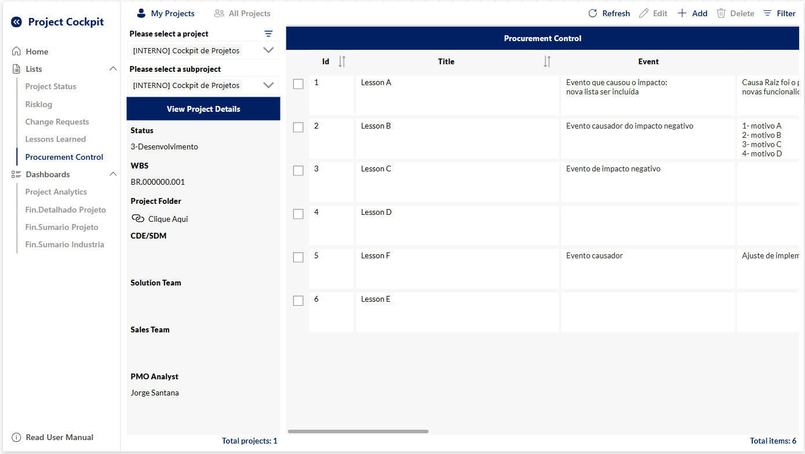
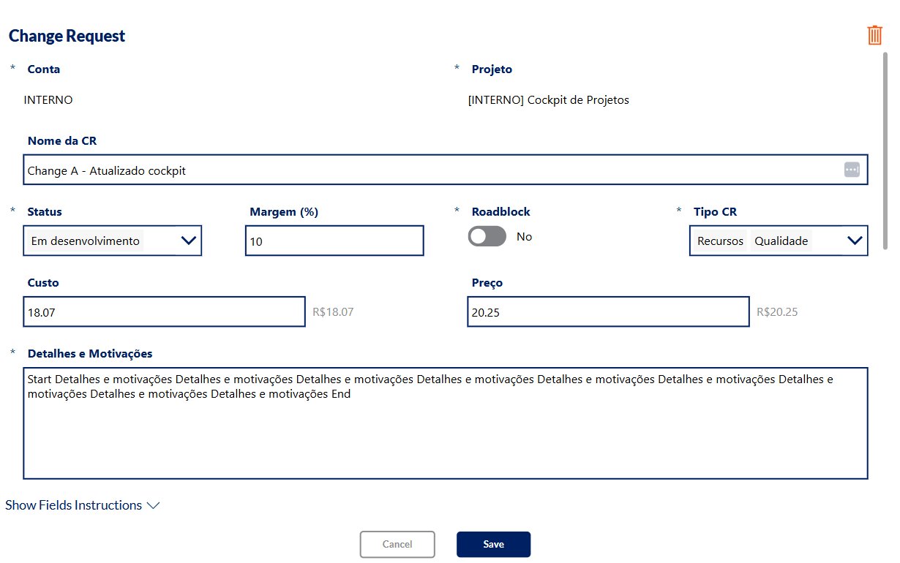
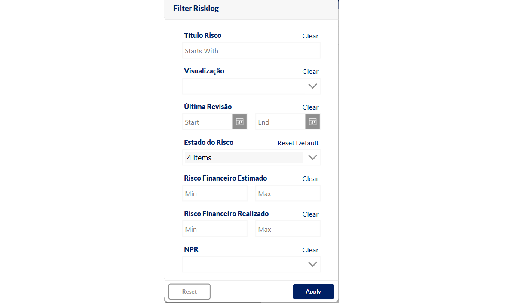
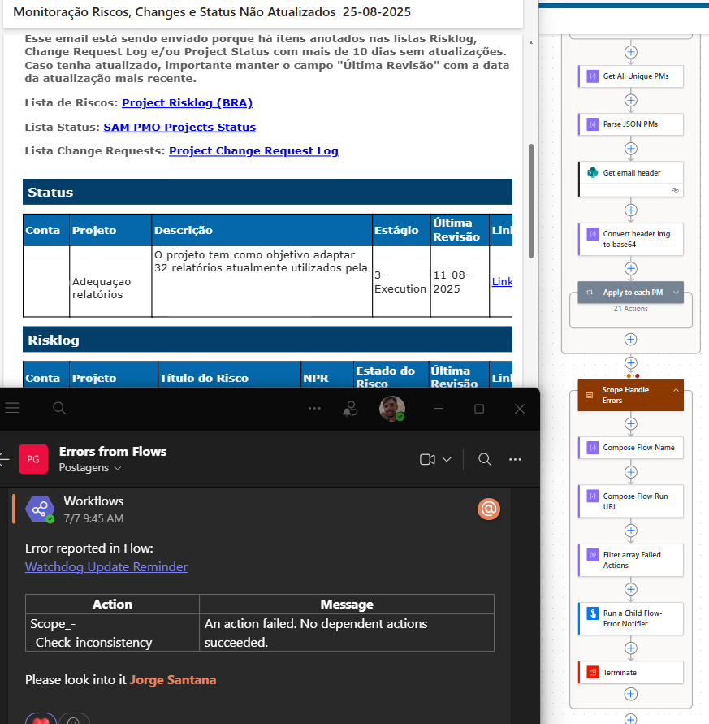
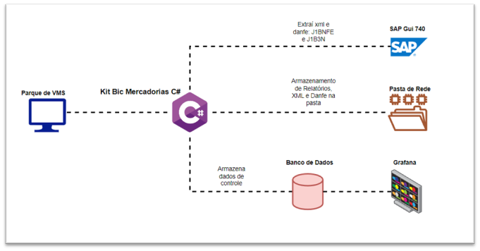
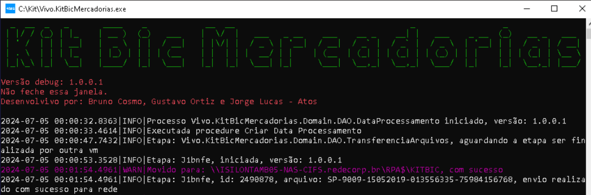
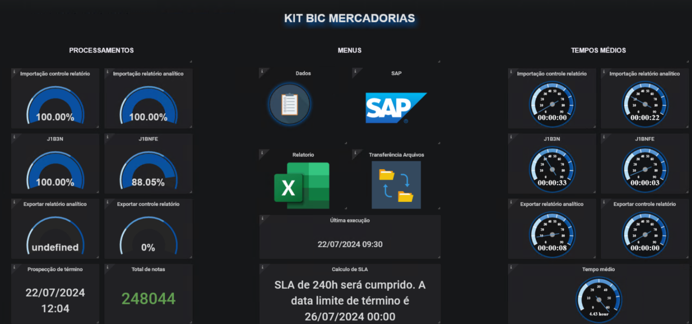
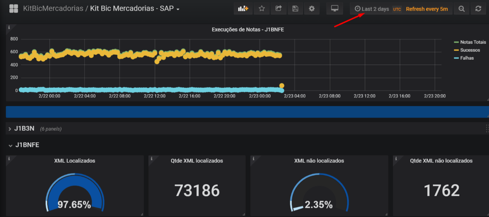
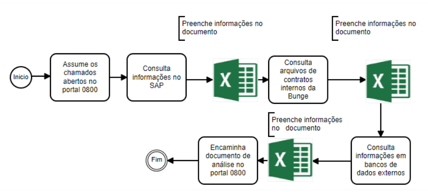
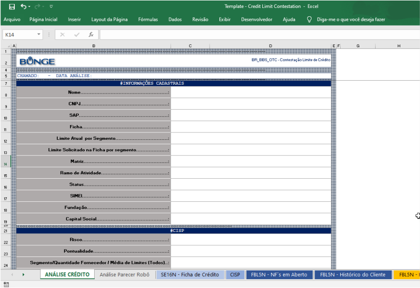

# Automation Engineer

#### Technical Skills: Power Platform, Blue Prism, C#, SQL, Azure, Git, SAP

## Education
- Control and Automation Engineering | UFSC (_December 2019_)

## Work Experience and Projects

### Atos | RPA Analyst | São Paulo, SP (Remote) | Oct. 2021 – Present
- Developed a **Power Apps** canvas app for the Project Management Office that enables managers to consult and update project data in **SharePoint**.  
    
    
    

- Managed the **Power Platform** environment and solutions, including Power Automate, Power BI, and Power Apps.  

- Created automated flows in **Power Automate** to send HTML/CSS-formatted email reports to project managers. Implemented an error-handling mechanism that sends detailed notifications to a **Teams** channel whenever a flow fails.  
    

- Administered **SharePoint** pages/lists and documented processes and solutions.  

- Worked as an **RPA Consultant** for **Vivo Telefônica**, developing a C# console automation called **KitBicMercadorias**.  
  - This solution runs on over 60 simultaneous virtual machines, extracts SAP documents, and is orchestrated through **Control-M**.  
  - Results are monitored and visualized via **Grafana dashboards**.  
    
    
    
    

---

### WEG | RPA Developer | Jaraguá do Sul, SC (Remote) | Mar. 2021 – Oct. 2021
- Developed **Blue Prism** automation solutions integrating **SAP** and **ServiceNow** through APIs.  

---

### Bunge | RPA Developer | Gaspar, SC | Jul. 2019 – Feb. 2020
- Built a **Blue Prism** automation for customer credit analysis.  
  - The solution collects data from ERP systems and external websites.  
  - It calculates and assigns a credit score to support decision-making.
    
    
